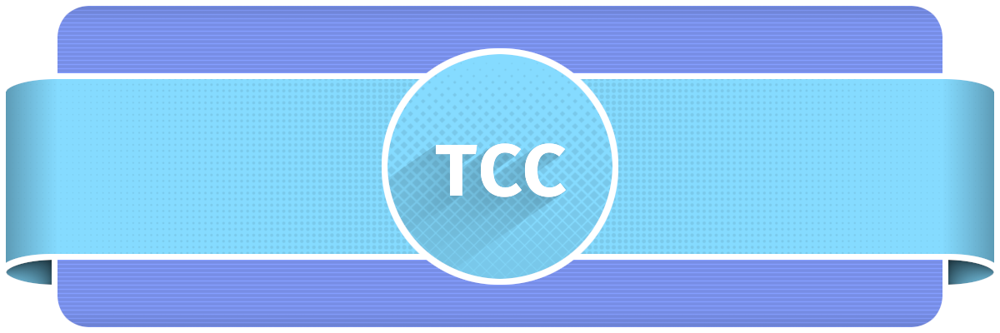

[](https://github.com/auryan/TCC-SENAI-2023)

<div align="center">
	<a target="_blank" href="http://commitizen.github.io/cz-cli/">
		
	</a>
</div>

## :dart: Projeto

Ainda não definido.

### Orientadora
- :red_circle: Cristiana Pereira Bispo.

### Equipe
- :orange_circle: [Bruno de Santana Carvalho](https://github.com/Brunoxs4444);
- :green_circle: [Cleyan Sampaio dos Santos](https://github.com/auryan);
- :yellow_circle: Elber Luiz Batista Costa;
- :large_blue_circle: Jeane Aparecida Ferreira Cerqueira;
- :purple_circle: [Kaylan Santos da Silva](https://github.com/Kaylan-Santos).

## :speech_balloon: Padrão de Commits

Para padronizar as mensagens de commits, utilizamos o **Commitizen** com o adaptador **cz-git**.

> [**Commitizen**](https://github.com/commitizen/cz-cli) é uma ferramenta de linha de comando baseada no Node.js que auxilia na geração de mensagens de commit padronizadas.
>> [**Cz-git**](https://github.com/Zhengqbbb/cz-git) é um adaptador que substitui o plugin interativo do Commitizen.

### Antes de qualquer coisa…
É importante que você tenha o [**Node.js**](https://nodejs.org/en/download/) em sua máquina e instale todas as dependências de desenvolvimento do projeto (o que pode ser feito executando o comando `npm install`).

### Quando for realizar um commit, execute o seguinte comando:
```bash
npx cz
```


O `Commitizen` irá abrir uma interface para que você possa escrever o commit. Basta seguir os passos e preencher os campos de forma correta.

## :file_folder: Sobre o repositório
Este repositório serve como um organizador para o nosso **TCC** (Trabalho de Conclusão de Curso) no curso de **Desenvolvimento de Sistemas**, realizado na instituição de ensino **SENAI** (Serviço Nacional de Aprendizagem Industrial), unidade **Lauro de Freitas** - **Bahia**.

Ele inclui todos os arquivos relevantes para o trabalho, incluindo o projeto, relatórios de progresso, apresentações, o texto final do trabalho, etc. Além disso, este repositório permite a colaboração com orientadores e membros da equipe, permitindo que todos acessem e façam contribuições ao projeto de forma fácil e organizada.

---

> "*É mais provável que a explicação que exige o menor número possível de suposições esteja correta.*"  
> — [**William of Ockham**](https://pt.wikipedia.org/wiki/Navalha_de_Ockham).